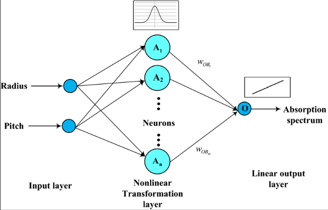
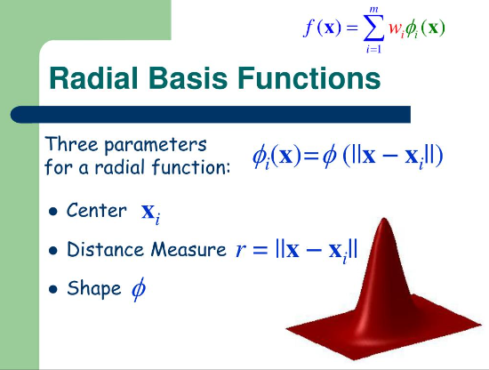

  # Radial Basis Function (RBF)

## Introduction

Radial Basis Functions (RBFs) are mathematical functions whose value depends on the distance from a central point or prototype. They are widely used in fields such as interpolation, approximation, and machine learning for their ability to capture complex relationships in data.
## History of Radial Basis Functions (RBFs)

Radial Basis Functions (RBFs) have a rich history dating back to the mid-20th century when they first emerged in the field of numerical analysis and approximation theory.

### Early Developments

- **1960s**: RBFs began to gain attention in the context of solving partial differential equations and as a method for numerical differentiation and integration.
  
- **1970s**: The concept of RBFs was further explored and expanded upon in the context of interpolation theory, where they were used to approximate functions based on scattered data points.

### Advancements in Approximation Theory

- **1980s**: Significant advancements in approximation theory led to the widespread adoption of RBFs for function approximation tasks. Researchers explored various types of RBFs, such as Gaussian, Multiquadric, and Thin-plate spline functions, each with specific properties suited to different applications.

### Application in Machine Learning

- **1990s - Present**: RBFs found extensive application in machine learning, particularly in the training of neural networks as activation functions. They also became popular as kernels in support vector machines (SVMs), enabling these models to handle complex, nonlinear decision boundaries effectively.

### Contemporary Use and Research

- **Present Day**: RBFs continue to be a subject of active research and development across multiple disciplines. Their versatility in capturing nonlinear relationships and handling localized patterns makes them indispensable in fields ranging from computational mathematics to artificial intelligence and data science.
## Significance of Radial Basis Functions (RBFs)

- **Nonlinear Approximation**: Effectively approximate complex, nonlinear relationships in data.
- **Interpolation and Smoothing**: Excel in interpolating between known data points and smoothing noisy data.
- **Localized Influence**: Exhibit localized influence, focusing on local patterns and anomalies in data.
- **Machine Learning Applications**: Used as activation functions in neural networks and kernel functions in SVMs.
- **Versatility in Functionality**: Various types cater to different application needs (e.g., Gaussian, Multiquadric).
- **Solid Theoretical Foundation**: Built on mathematics and approximation theory, refined over decades.
- **Applications in Engineering and Science**: Used in geophysics, fluid dynamics, image processing, and bioinformatics.

## Architectural Diagram
 

 ## Mathematical Model
 

 ## Radial Basis Function (RBF) Algorithm

1. **Input**:
   - Training data: \( \{ (\mathbf{x}_i, y_i) \}_{i=1}^N \) where \( \mathbf{x}_i \) is the input vector and \( y_i \) is the corresponding target value.
   - Parameters: \( \epsilon \) (width parameter), \( \mathbf{c}_1, \mathbf{c}_2, \ldots, \mathbf{c}_k \) (center vectors), \( \lambda \) (regularization parameter).

2. **Choose Centers**:
   - Select \( k \) centers \( \mathbf{c}_1, \mathbf{c}_2, \ldots, \mathbf{c}_k \) from the training data or using clustering techniques.

3. **Compute Distance Matrix**:
   - Calculate the distance \( r_{ij} = ||\mathbf{x}_i - \mathbf{c}_j|| \) for each pair \( (\mathbf{x}_i, \mathbf{c}_j) \).

4. **Construct Design Matrix**:
   - Form the design matrix \( \Phi \) where \( \Phi_{ij} = \phi(r_{ij}) \) for \( i = 1, \ldots, N \) and \( j = 1, \ldots, k \), using the chosen radial basis function \( \phi(r) \).

5. **Solve Linear System**:
   - Solve the linear system \( \Phi \mathbf{w} = \mathbf{y} \), where \( \mathbf{w} \) are the weights to be learned and \( \mathbf{y} \) is the vector of target values.

6. **Regularization (Optional)**:
   - If regularization is used, modify the linear system to \( (\Phi^T \Phi + \lambda I) \mathbf{w} = \Phi^T \mathbf{y} \), where \( I \) is the identity matrix.

7. **Prediction**:
   - For a new input \( \mathbf{x}_{\text{new}} \), compute its distance to each center \( \mathbf{c}_j \), calculate \( \phi(||\mathbf{x}_{\text{new}} - \mathbf{c}_j||) \) for each \( j \), and predict \( \hat{y}_{\text{new}} = \sum_{j=1}^k w_j \phi(||\mathbf{x}_{\text{new}} - \mathbf{c}_j||) \).

8. **Output**:
   - Return predictions \( \hat{y}_{\text{new}} \) for all new input vectors.

## Applications of Radial Basis Functions (RBFs)

Radial Basis Functions (RBFs) find diverse applications across various fields due to their unique properties and capabilities:

1. **Function Approximation**
  
   
2. **Machine Learning**
   - **Neural Networks**
   - **Support Vector Machines (SVMs)** 
3. **Image Processing**

4. **Computational Fluid Dynamics (CFD)**
   
5. **Bioinformatics**
   

7. **Financial Forecasting**
  
8. **Geophysical Modeling**
   
9. **Robotics and Control Systems**
   
10. **Pattern Recognition**
    
  
